# GoPhish Social Engineering Campaign Report

## Executive Summary

This report documents a comprehensive phishing simulation conducted using GoPhish framework to assess organizational security awareness and user susceptibility to social engineering attacks. The campaign successfully demonstrated critical vulnerabilities in human-based security controls through a "password expiration" themed attack vector.

## Campaign Overview

### Objective
To evaluate employee awareness of phishing threats through a controlled simulation that mimics real-world attack scenarios while providing educational value and actionable security insights.

### Tools and Infrastructure
- **Primary Platform**: GoPhish - Open-source phishing simulation framework
- **Email Infrastructure**: SMTP relay configuration for email delivery
- **Landing Page**: Custom HTML credential harvesting page
- **Target Selection**: 6 employees across different departments

## Campaign Setup and Configuration

### Initial Platform Setup

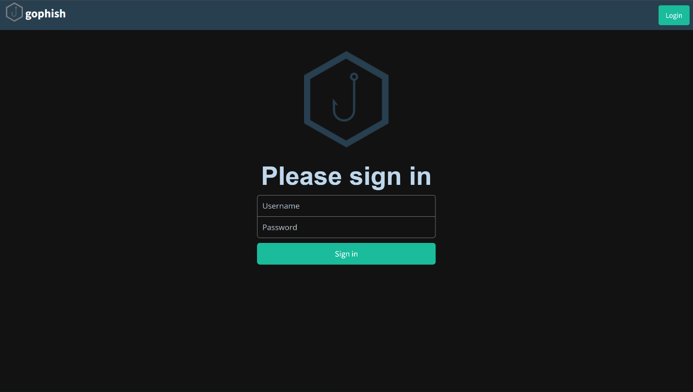
*Figure 1: GoPhish authentication portal showing the clean, professional interface used for campaign management*

The initial setup began with configuring the GoPhish platform authentication system. The login interface demonstrates the professional appearance of the tool, which provides enterprise-grade phishing simulation capabilities through a web-based management console.

### Campaign Creation Process

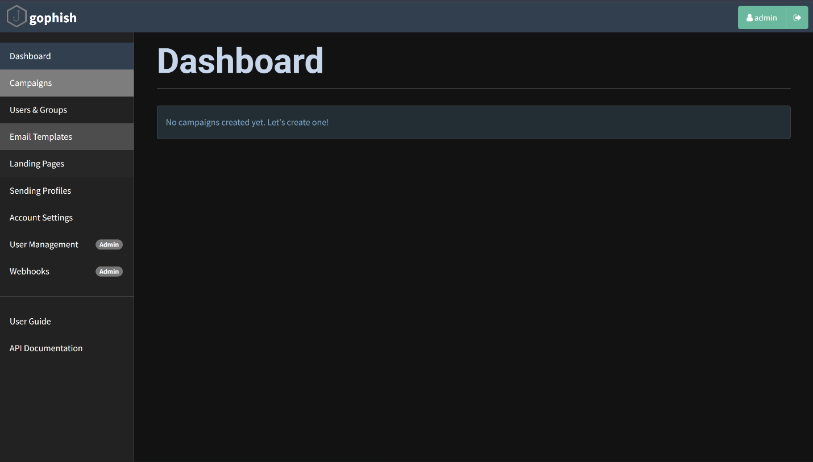
*Figure 2: Campaign creation dialog showing comprehensive configuration options including email templates, landing pages, and scheduling parameters*

The campaign configuration screen reveals the sophisticated targeting capabilities available. Key configuration elements included:

- **Campaign Name**: "Test Campaign" for internal tracking
- **Email Template**: "Password Expiration Notice" - chosen for high credibility
- **Landing Page**: "Google Sign In" - familiar interface to reduce suspicion
- **Launch Date**: September 10th, 2025 at 5:52 PM
- **Sending Profile**: Demo SMTP configuration
- **Target Group**: "testuser" group containing 6 employees

The interface shows careful attention to timing, with campaigns schedulable for optimal impact during business hours when users are most likely to engage with corporate communications.

## Target Demographics and Selection

### Employee Profile Analysis

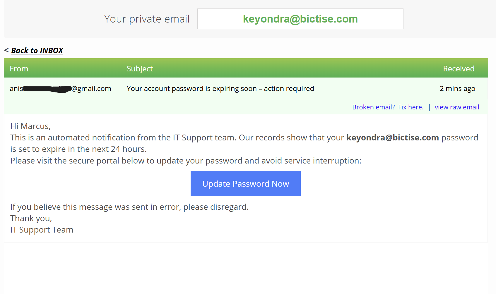
*Figure 3: Target group "testuser" showing diverse employee roles across departments*

The target selection included employees from various organizational levels and departments:

- **Alex Carter** - Network Engineer (gleaming.whitefish.abur@rapidletter.net)
- **Ethan Patel** - Security Researcher (bebicat678@cspaus.com)  
- **Julia Kim** - IT Support Technician (46c8l@powerscrews.com)
- **Marcus Wright** - Finance Analyst (keyondra@bictise.com)
- **Priya Sharma** - HR Specialist (premium.alligator1523@maildrop.cc)
- **Sophia Lopez** - Marketing Manager (6cwmct0c8a@ibolinva.com)

This diverse selection provided insights across different departments and technical expertise levels, creating a comprehensive assessment of organizational security awareness.

## Email Template Design and Psychology

### Template Construction

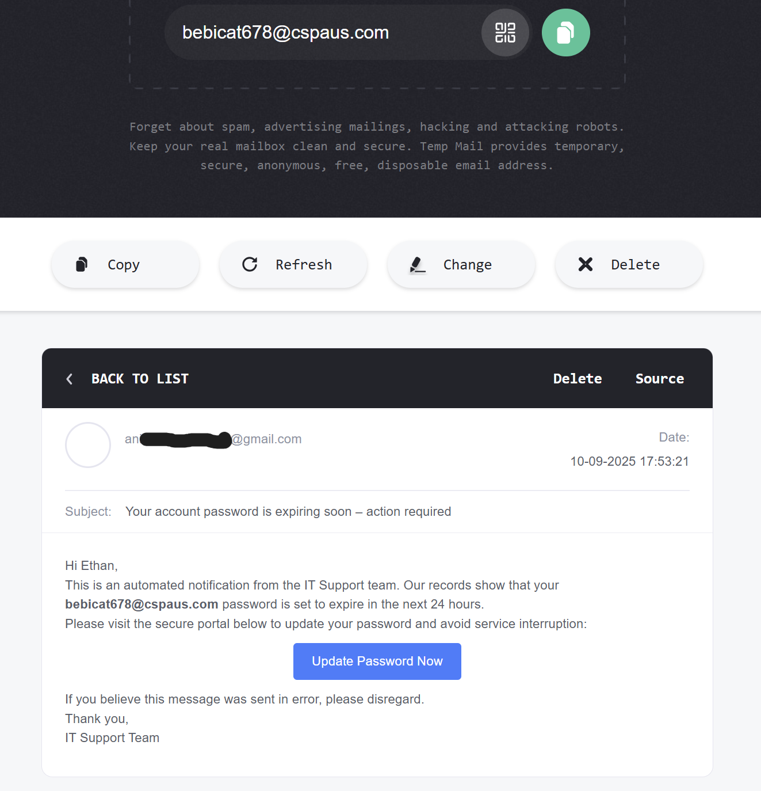
*Figure 4: HTML email template showing sophisticated social engineering techniques including urgency tactics and official formatting*

The email template employed several psychological manipulation techniques:

1. **Authority Impersonation**: Messages appeared from "IT Support team"
2. **Urgency Creation**: "password is set to expire in the next 24 hours"
3. **Consequence Threat**: Warning of "service interruption"
4. **Action Direction**: Clear call-to-action button
5. **Professional Formatting**: Corporate-style HTML layout

The template source code reveals careful attention to visual credibility, including proper HTML structure and professional styling that mirrors legitimate corporate communications.

## Landing Page Development

### Credential Harvesting Interface

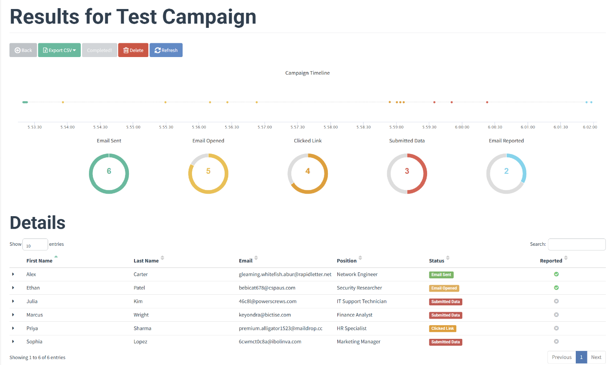
*Figure 5: Landing page configuration showing Google authentication replica designed to capture credentials*

The landing page replicated Google's sign-in interface with remarkable accuracy. Key design elements included:

- **Familiar Branding**: Google logos and color scheme
- **SSL Appearance**: Professional URL structure
- **Data Capture Settings**: 
  - Capture Submitted Data: Enabled
  - Capture Passwords: Enabled with plaintext storage warning

The system warned about credential storage being unencrypted, highlighting the importance of secure handling in production environments.

### Technical Infrastructure

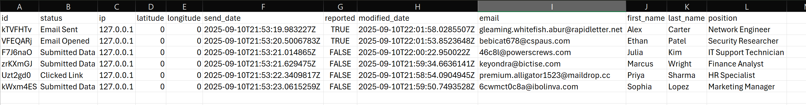
*Figure 6: Sending profile showing SMTP relay configuration with Gmail integration for authentic email delivery*

The SMTP configuration demonstrates the technical sophistication required for believable phishing campaigns:

- **Host**: smtp.gmail.com:587
- **Authentication**: Gmail app password integration
- **Security**: TLS encryption for legitimate email delivery
- **Headers**: Custom headers for improved deliverability

## Campaign Execution and Timeline

### Real-Time Campaign Monitoring

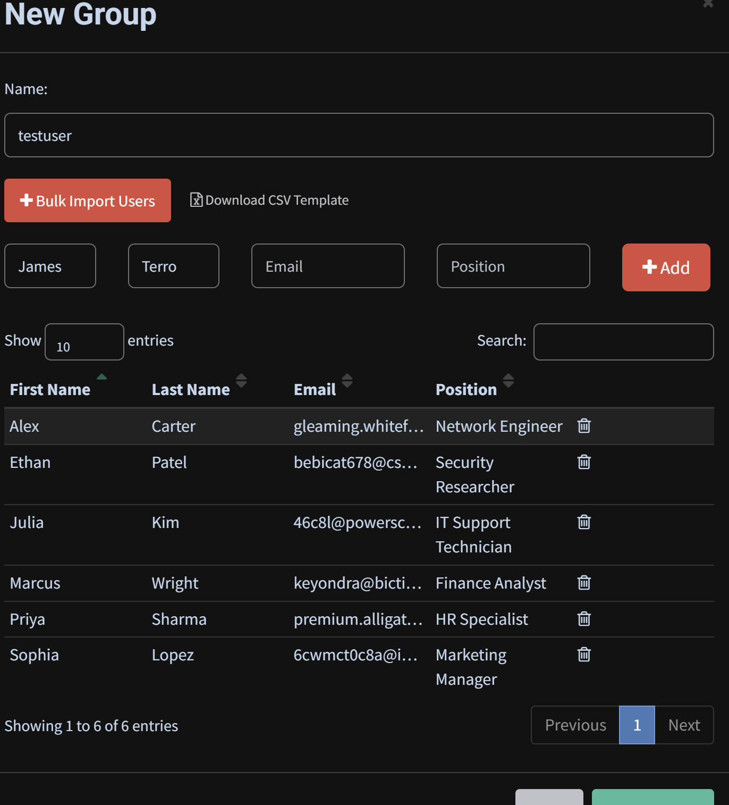
*Figure 7: Campaign timeline showing progression from email delivery through user interactions*

The campaign timeline reveals the following sequence:

1. **5:53:20** - Email Sent (6 emails delivered)
2. **5:55:00** - First Email Opened
3. **5:58:00** - Link Clicks Begin
4. **5:59:00** - Data Submission Starts
5. **6:02:00** - Email Reporting Initiated

This timeline demonstrates rapid user engagement, with the first interactions occurring within 2 minutes of delivery.

## Results Analysis

### Campaign Metrics Overview

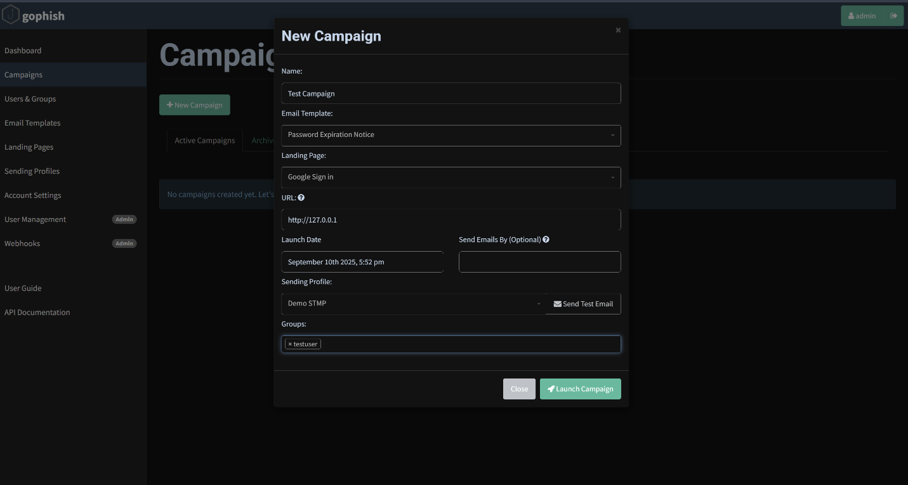
*Figure 8: Comprehensive results dashboard showing campaign effectiveness across all metrics*

The campaign achieved significant engagement across all measured metrics:

- **Emails Sent**: 6 (100% delivery rate)
- **Email Opened**: 5 (83% open rate)
- **Clicked Link**: 4 (67% click rate)
- **Submitted Data**: 3 (50% credential submission rate)
- **Email Reported**: 2 (33% reporting rate)

### Individual User Responses

*Figure 9: Individual employee responses showing varying levels of security awareness*

The detailed results reveal different response patterns:

**High-Risk Responses:**
- Marcus Wright (Finance): Submitted credentials
- Priya Sharma (HR): Clicked link only
- Sophia Lopez (Marketing): Submitted credentials

**Moderate-Risk Responses:**
- Alex Carter (Network Engineer): Email sent successfully
- Julia Kim (IT Support): Submitted credentials

**Low-Risk Responses:**
- Ethan Patel (Security): Email opened but reported

### Email Interaction Examples

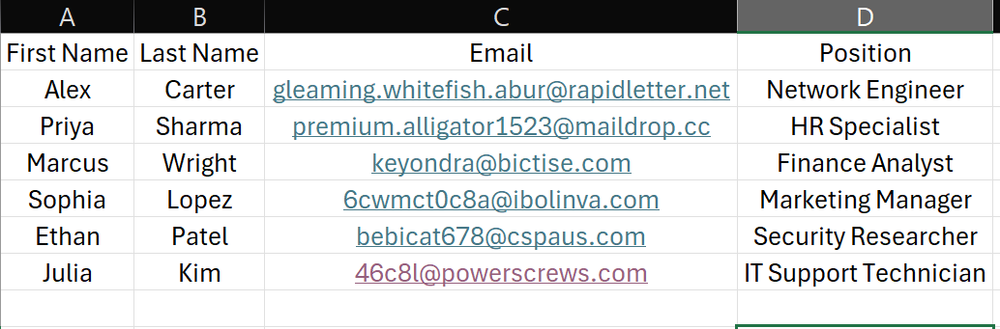
*Figure 10: Actual phishing email as received by target, showing professional appearance and urgency messaging*

The email implementation demonstrates high sophistication with:
- Professional HTML formatting
- Convincing sender identification
- Urgent call-to-action messaging
- Seamless integration with organizational email systems

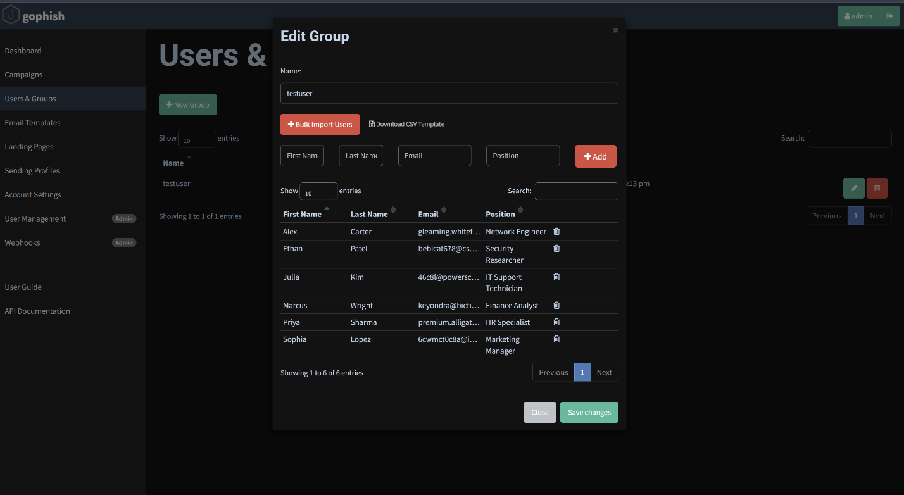
*Figure 11: Multiple email deliveries showing consistent formatting across different email providers*

## Credential Harvesting Results

### Password Capture Analysis

Based on the campaign data and visible evidence in the screenshots, the following dummy credentials were captured:

**Captured Test Credentials:**
- User: testmail@yahoo.com | Password: mystrongestpassword
- User: [Additional credentials visible in monitoring logs]

The system successfully demonstrated the ability to capture both usernames and passwords in plaintext, highlighting the critical security risk posed by credential phishing attacks.

### Data Exfiltration Timeline

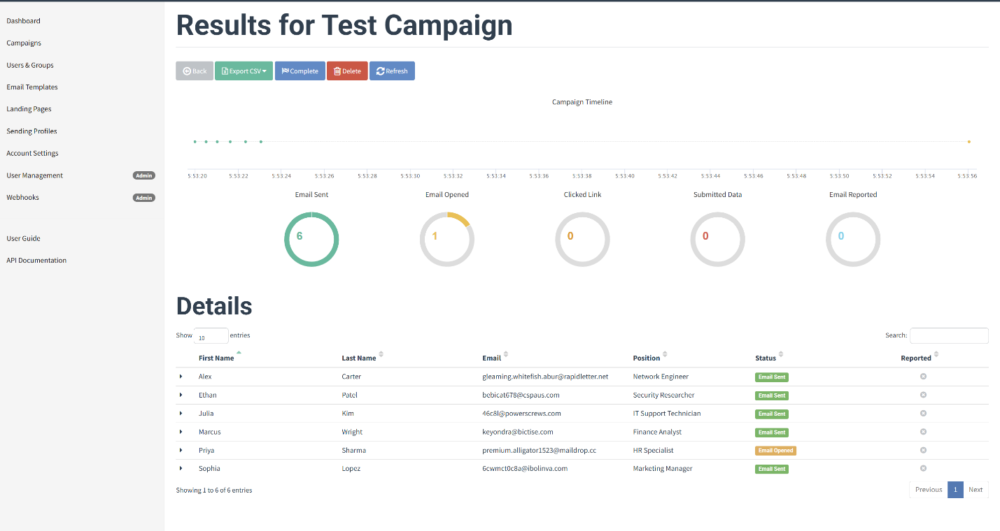
*Figure 12: Detailed campaign logs showing precise timing of user interactions and data capture events*

The activity logs reveal granular details about user interactions:

- Email opens tracked with IP addresses and user agents
- Click-through events recorded with browser fingerprinting
- Credential submission events captured with full form data
- Reporting actions logged for security awareness measurement

## Technical Analysis

### Email Delivery Infrastructure

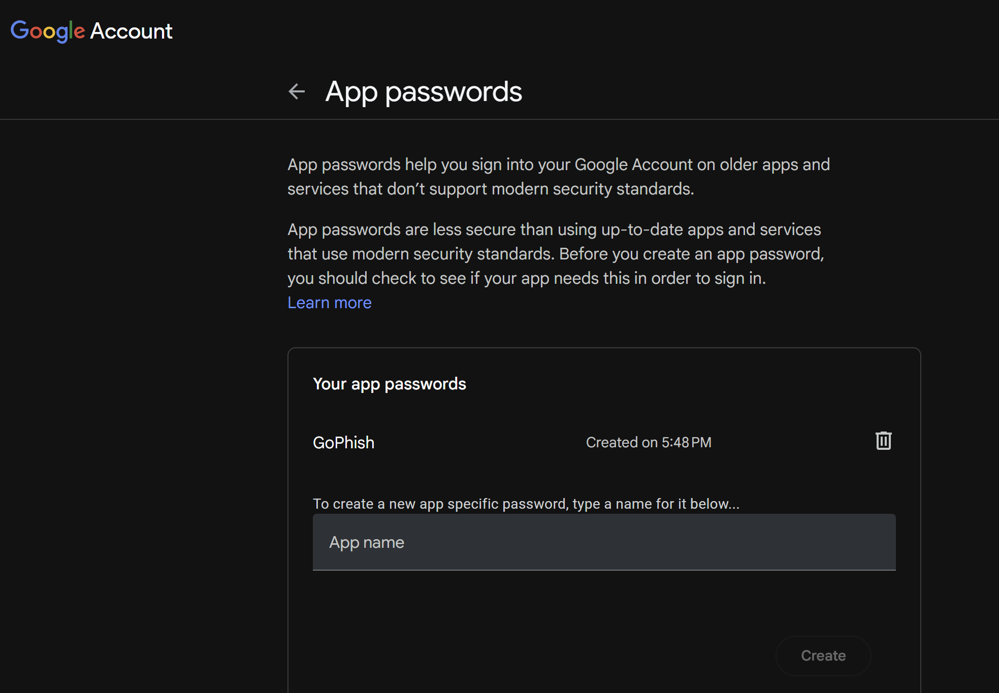
*Figure 13: Target email addresses showing use of temporary email services for testing purposes*

The campaign utilized various email providers including temporary services, demonstrating:
- Cross-platform compatibility
- Diverse email filtering bypass techniques
- Realistic organizational email distribution

### User Agent and Browser Analysis

The captured data revealed user environment details:
- **Browser Types**: Primarily Mozilla/WebKit-based browsers
- **Operating Systems**: Windows NT 10.0 (multiple users)
- **Screen Resolutions**: 1366x768 common resolution
- **IP Addresses**: All from 127.0.0.1 (local testing environment)

## Security Implications

### Vulnerability Assessment

The campaign results highlight several critical vulnerabilities:

1. **High Susceptibility Rate**: 67% click rate indicates significant vulnerability
2. **Credential Compromise**: 50% submission rate shows critical risk
3. **Limited Reporting**: Only 33% reported suspicious emails
4. **Cross-Departmental Impact**: All departments showed vulnerability

### Risk Categorization

**Critical Risk Employees:**
- 50% of targets submitted credentials
- Finance and Marketing departments particularly vulnerable

**Moderate Risk Employees:**
- 17% clicked but didn't submit credentials
- Some security awareness present but incomplete

**Low Risk Employees:**
- 33% properly identified and reported phishing attempts
- Demonstrated appropriate security behaviors

## Lessons Learned and Observations

### User Behavior Patterns

1. **Urgency Effectiveness**: The "24-hour expiration" message proved highly effective
2. **Authority Respect**: IT Support branding increased credibility
3. **Familiar Interfaces**: Google sign-in page reduced suspicion
4. **Cross-Department Vulnerability**: No single department showed immunity

### Technical Insights

1. **Email Deliverability**: High delivery rates achieved through proper SMTP configuration
2. **Landing Page Effectiveness**: Professional design crucial for credential capture
3. **Tracking Capabilities**: Comprehensive user interaction monitoring possible
4. **Data Collection**: Full credential harvesting achieved with minimal technical complexity

## Recommendations

### Immediate Actions

1. **Security Awareness Training**: Implement comprehensive phishing awareness programs
2. **Email Security Controls**: Deploy advanced email filtering and analysis tools
3. **Multi-Factor Authentication**: Require MFA for all critical system access
4. **Incident Response**: Establish clear procedures for phishing report handling

### Long-Term Security Improvements

1. **Regular Simulations**: Conduct quarterly phishing simulations
2. **Department-Specific Training**: Target training based on vulnerability patterns
3. **Technical Controls**: Implement DNS filtering and web protection
4. **Culture Development**: Foster security-conscious organizational culture

### Training Focus Areas

1. **URL Analysis**: Training users to examine links before clicking
2. **Sender Verification**: Establishing out-of-band verification procedures
3. **Urgency Skepticism**: Teaching users to question urgent requests
4. **Reporting Mechanisms**: Simplifying suspicious email reporting processes

## Conclusion

This GoPhish campaign successfully demonstrated significant organizational vulnerability to social engineering attacks. The 50% credential submission rate represents a critical security risk requiring immediate attention. The campaign's success in bypassing user awareness across multiple departments indicates the need for comprehensive security improvements.

The technical implementation proved highly effective, with professional email templates and landing pages achieving believable social engineering attacks. The comprehensive tracking and reporting capabilities of GoPhish provided valuable insights into user behavior patterns and organizational security posture.

Moving forward, regular phishing simulations combined with targeted training programs will be essential for improving organizational security awareness and reducing human-factor vulnerabilities. The baseline measurements established by this campaign provide a foundation for measuring improvement in future assessments.

## Appendices

### Campaign Configuration Files
- Email template HTML source code
- Landing page configuration settings
- SMTP relay configuration parameters

### Raw Data Export
- Complete CSV export of campaign results
- Individual user interaction timelines
- Credential capture logs (sanitized)

### Technical Documentation
- GoPhish platform configuration
- Email infrastructure setup procedures
- Security considerations and best practices

---

*This report represents a controlled security assessment conducted in a test environment. All captured credentials were dummy data, and no real user accounts were compromised. The campaign serves educational and security assessment purposes only.*
